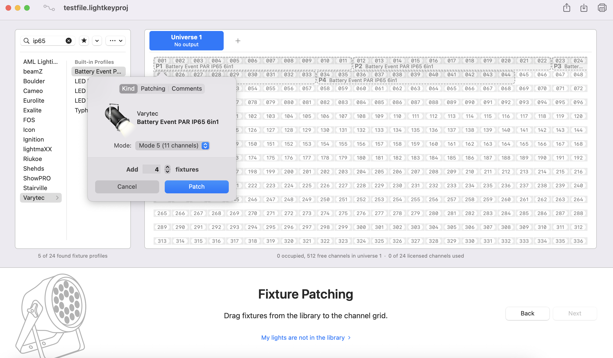

# Lightkey

## Einleitung

Lightkey zeichnet sich durch seine einfache Bedienung, die wenig aufwendige Nutzung als reine Computer-Software (also ohne obligatorisches Pult aus). Die Midi- und OSC-Fähigkeit sind weitere große Vorteile genauso wie die visuelle Abbildung davon, was die Lampen tun. Die große Einschränkung der Software ist, dass sie nur auf MacOS läuft. Als Alternative kann QLC+ verwendet werden.

## Setup

Zunächst erläutern wir, wie du Lightkey für das Soundworx-Setup vorbereitest. Wenn du unser Vorlagen-Projekt für Soundworx verwenden willst, springe direkt zu First Steps.

### Enttec Open DMX USB

Zunächst fragt dich Lightkey nach deinem USB-Interface. Im Soundworx Setup haben wir ein Enttec Open DMX USB Interface. Wenn du es angeschlossen hast, findet es Lightkey automatisch. Wähle es aus und klicke auf weiter.

### Lampen hinzufügen

1. Suche die Lampe in der Gerätebibliothek
2. Ziehe sie ins Universum und gib die Anzahl der Geräte an. Unter Info kannst du einen Namen vergeben. Wir empfehlen je nach Lampenart einen oder zwei Buchstaben. Wir nutzen:
    1. Varytec 6in1 Event Par: P
    2. ABL Sunbars: S
    3. Fluter: F
    4. Q-Spot: Q
    5. Moving Wash: MH
    6. Hazer und Nebelmaschine: N
3. Wenn du alle Lampen hinzugefügt hast, klicke auf weiter.
4. In der nächsten Ansicht kannst du die Lampen auf der virtuellen Oberfläche verteilen. Schiebe sie am besten so hin, wie das Setup aufgebaut ist.
5. Dann fragt dich die Software noch nach der Ausrichtung der Moving Washes und, ob du Gruppen bilden möchtest. Wir gruppieren immer die ähnlichen Lampen. Das hat zur Folge, dass du immer alle auswählst, wenn du eine anklickst. Klickst du erneut, hast du nur die einzelne Lampe angewählt.
6. Klicke auf Fertig und du hast deine eigene Oberfläche konfiguriert. Wir fahren jetzt mit der Vorlagen-Datei von Soundworx fort, in die schon einiges einprogrammiert ist.
 

## First Steps

<figure class="video_container">
  <video controls="true" allowfullscreen="true">
    <source src="../vid-01.mp4" type="video/mp4">
  </video>
</figure>

1. Zunächst ist es entscheidend, dass die Lampen das machen, was du von ihnen willst. Überprüfe, ob das DMX Interface verbunden ist. Wenn nicht, öffne die Einstellungen, navigiere zu DMX-Ausgabe und aktiviere Open-DMX-Interfaces. Wir haben im Soundworx-Projekt die Hertz-Zahl 22 Hz genutzt, weil es dann zu keinem Flackern in unserer Stromumgebung kam. Falls es flackert, ändere hier die Frequenz. Wenn du es aktiviert hast, sollte es oben links in grau angezeigt werden.
2. Überprüfe, ob die Lampen jetzt schon das tun, was du möchtest. Tun sie das nicht, überprüfe die DMX-Adresse, die Kanal-Einstellungen, die Stromversorgung und die Verkabelung. Siehe hierzu auch Trouble-Shooting. In einigen Fällen war es nötig, die Software neu zu starten, wenn keine Verbindung zustande kam.

Hinweis: Lightkey fragt dich häufig nach deinem Admin-Kennwort. Stelle unbedingt sicher, dass du es weißt, sonst kann Lightkey sich auch während der Show deaktivieren.

Nachdem du die First Steps ausgeführt hast und die Lampen angesprochen werden, können wir uns nun den verschiedenen Bereichen von Lightkey widmen.

## Bereiche

Grundsätzlich zeigt Lightkey immer das Vorschaufenster an. Wichtig sind die unteren Rider „Design“ und „Live“. Wenn du zwei Monitore zur Verfügung hast, lege sie nebeneinander. Das spart Nerven und Zeit und hilft bei der Orientierung.

### Vorschaufenster

Im Vorschaufenster siehst du deine Lampen und, was gerade passiert. Du kannst die Lampen anklicken und sie bearbeiten. Wenn du den ersten Buchstaben eintippst, markierst du alle Lampen mit diesem Buchstaben. Du kannst auch den Buchstaben und die Zahl antippen, dann erhältst du zum Beispiel die Lampe „Q4“.

### Design-Fenster

Im Design-Fenster kannst du sämtliche Einstellungen für die Lampen vornehmen. Grundsätzlich gibt es dort die folgenden Parameter:

#### Grundlagen

- **Dimmer**: stellt die Helligkeit ein, die du an die Lampe sendest. Hast du keine Farbe angewählt, schickt Lightkey ein blaues Signal raus. Merksatz: Wenn der Dimmer auf 0 ist, siehst du nichts.
- **Farbe**: Hier stellst du die Farben ein, die deine Lampe abbilden soll. Du hast ein Farbrad, in dessen äußeren Kreis du den Farbwert einstellen kannst. Im inneren Kreis Kannst du links die Sättigung einstellen (voller Farbton hinzu weiß) und rechts die Helligkeit (voller Farbton hinzu schwarz). Dazu haben manche Lampen noch weitere Regler, z. B. für Weißlicht, Amber (Warmweiß), Schwarzlicht (UV) oder bei den Sunbars für die Blinder.
- **Shutter/Strobo**: Hier kannst du den Shutter steuern. In der Regel sollte er offen sein. Wenn du ihn auf Strobo stellst, sei vorsichtig mit Epilepsie und wie dunkel es sonst ist. Von Schlecht werden bis hin zu Anfällen kann echt alles passieren. Was manchmal sinvoll sein kann, ist die Puls-Funktion, die einige Lampen haben. Puls ist langsamer als Strobo und kann gut einen Effekt auf den Beat legen.

- **Die weiteren Felder** sind für Soundworx mit wenigen Ausnahmen nicht interessant.

#### Effekte

{ width="50%" }

**Dimmer-Effekte**: Wenn du auf das Wort „Dimmer“ klickst, öffnet sich ein weiteres Menü. Hier können Effekte hinzugefügt werden. Du kannst eine der Vorlagen aus der Kategorie „Dimmer“ nehmen oder einen eigenen Effekt erzeugen. Wir haben uns nur mit Kurven-basierten Effekten beschäftigt. Es gibt noch mehr zu entdecken. Wenn du einen Kurven-Effekt auswählst, öffnet sich ein Fenster, welches dir auf einer Zeitachse die Intensität des Dimmers anzeigt. Rechts kannst du Vorlagen auswählen und bei mehreren Lampen einen Zeitversatz. (Beispiel: ein Zeitversatz von 50% bei zwei Lampen bedeutet, dass sie abwechselnd Blinken, Angehen, Ausgehen je nach gewähltem Effekt.) Du kannst die Graphen auch von Hand selbst verschieben. Du verlässt die Einstellungen, in dem du wieder auf den Rider Design klickst. Auf dem Dimmer erscheint jetzt ein „Effekt-Symbol“. Durch Klicken kommst du wieder in den Effekt.

{ width="50%" }

**Farb-Effekte:** Wenn du auf das Wort „Farbe“ klickst, öffnet sich ein weiteres Menü. Hier können Effekte hinzugefügt werden. Du kannst eine der Vorlagen aus der Kategorie „Farbe“ nehmen oder einen eigenen Effekt erzeugen. Im Unterschied zu Dimmer-Effekten kannst du hier auch Muster-Effekte erstellen. Bei einem Muster-Effekt wählst du verschiedene Felder an, die nacheinander abgespielt werden (bei bspw. einem PAR), bei den Sunbars allerdings kannst du zehn Felder angeben und

#### Spezialfall Sunbars

<figure class="video_container">
  <video controls="true" allowfullscreen="true">
    <source src="../vid-04.mp4" type="video/mp4">
  </video>
</figure>

Am Beispiel der Sunbar wird gut deutlich, was alles an Effekten kombiniert werden kann. Wir haben 4 rosa Felder von links nach rechts laufen lassen, dazu 3 blaue Felder von rechts nach links. Und zusätzlich flashen die Blinder. In der Beispiel-Datei findest du die Einstellungen dazu unter Oktave c3, 312-h-3.

#### Spezialfall Moving Washes

<figure class="video_container">
  <video controls="true" allowfullscreen="true">
    <source src="../vid-02.mp4" type="video/mp4">
  </video>
</figure>

**Positionseffekte:** Durch Shift+P bei ausgewählten Moving Heads oder Rechtsklick und "Position" kommst du in das Positions-Menü. Als Kreis ist hier abgebildet, wo die Moving Washes hinzeigen. Durch Klicken kannst du sie an eine bestimmte Position fahren lassen. Wenn du die Position als Szene speicherst und danach eine weitere Position als Szene speicherst, wird der Moving Head von A nach B fahren, wenn du die Szenen abspielst. Darüber hinaus kannst du aber auch Positionseffekte hinzufügen. Klicke dazu auf "Position" + "Positionseffekt hinzufügen"

<figure class="video_container">
  <video controls="true" allowfullscreen="true">
    <source src="../vid-03.mp4" type="video/mp4">
  </video>
</figure>

**Zoom:** Unsere Moving Washes haben auch eine Zoom-Funktion. Das heißt, dass sie ihren Lichtkegel bewegen können und größer und kleiner machen. Durch Shift+Z kommst du in das Menü. Wie bei den Positionseffekten kannst du nach Klick auf "Zoom" und "Zoom-Effekt hinzufügen" unten aus verschiedenen Effekten wählen.

### Einstellungspalette

{ width="50%" }

In der Einstellungspalette hast du die Möglichkeit, Szenen, Loops und Gruppen zu speichern. Um eine neue Szene zu gestalten, stelle sicher, dass keine Lichter an sind und keine Lichter ausgewählt. Klicke dann auf das „+“-Symbol oben rechts und eine Leere Einstellung (gelb unterlegt) erscheint. Jetzt kannst du an den Lampen Einstellungen verändern und am Ende auf Speichern drücken. So kannst du eine Stimmung sichern oder einzelne Effekte modular abspeichern. Wenn du dir die Vorlagen-Datei anschaust, kannst du sehen, dass die Einstellungen nach Lampen und Funktionsweise sortiert sind. Warum wir das so gemacht haben und was die unterschiedlichen Bedienungen sind, erläutern wir im Block [Live-Fenster](#Live-Fenster).

### Shortcuts

{ width="50%" }

Dieses praktische kleine Fenster unten rechts sagt dir immer, welche Tastenkombinationen gerade gehen und was sie machen. Unser Tipp: Beachte es, wir haben beim Setup öfter mal bemerkt, dass da gute Details im richtigen Moment angezeigt werden.

### Live-Fenster

Das Live-Fenster wird genutzt, um Stimmungen und Shows zu fahren und zusätzlich im Fall Soundworx, um die Buttons und die Szenenliste zu programmieren, die dann von Ableton aus angesteuert wird. In der Beispiel-Datei findest du 2x12 Buttons, die mit den untersten beiden MIDI-Oktaven angesteuert werden können. Außerdem auf der rechten Seite eine Szenenliste mit 12 Szenen (die drittunterste MIDI-Oktave). Weiter unten im Live-Feld haben wir als Ergänzung eine Beispiel-Anordnung gestaltet, die auf einen MIDI-Controller angepasst ist.

#### *Buttons*

{ width="70%" }

Buttons können als Toggle oder Touch angelegt werden. (Siehe auch Programmieren => Lichtsteuerung) Durch Rechtsklick und neue Taste/Button kannst du sie erstellen. Sie können im Feld bewegt werden. Wichtig: Auch Fader kannst du so anlegen. Wenn du den Button anwählst, kannst du im Info-Feld Szenen und Einstellungen hinzufügen. Wenn der Button ausgewählt wird, werden alle Einstellungen/Szenen aktiviert.

#### *Szenenliste*

Die Szenenliste ermöglicht es dir, vorprogrammierte Stimmungen der Reihe nach abzufahren. Du kannst auch eine automatische Länge einstellen. Diese Einstellungsmöglichkeit ist der Hauptunterschied zu den Buttons. Ansonsten kannst du auch hier im Info-Feld Stimmungen und Szenen hinzufügen.

 

#### *Individuelle Steuerungseinheit* (Steuerung via MIDI)

Um in die Lichtsteuerung eingreifen zu können, ohne direkt am Rechner klicken zu müssen, kann ein MIDI-Pult angeschlossen werden. In der Beispiel-Datei findest du die Anordnung eines Launch Control XL. Das Prinzip ist, dass du Buttons und Fader anordnest und programmierst, die dann durch Rechtsklick entsprechend der Controller-Tasten angeordnet mit dem Pult verknüpfst. (Rechtsklick + External Control + Add Trigger + Taste am Midi-Pult drücken)

 
## Die Projektdatei

[Hier](soundworx.lightkeyproj) findest die Projektdatei von Soundworx.
 
