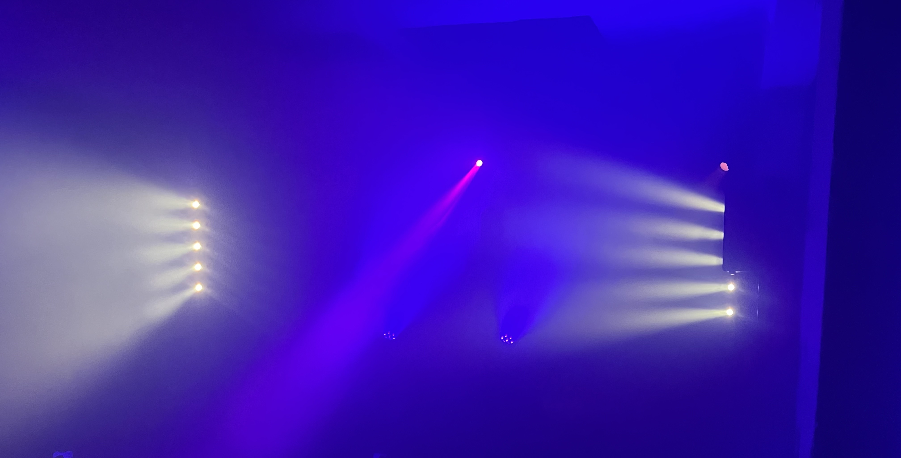
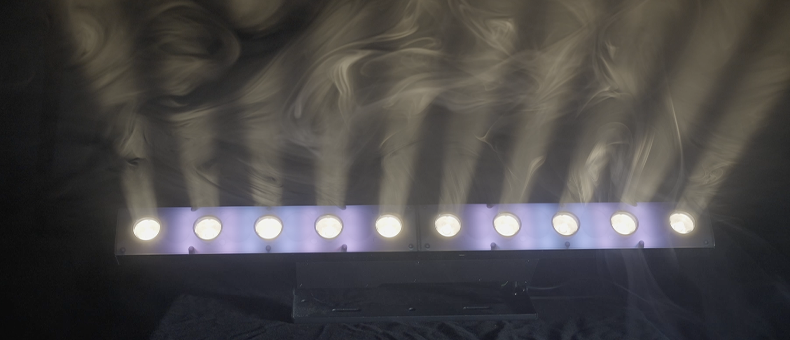
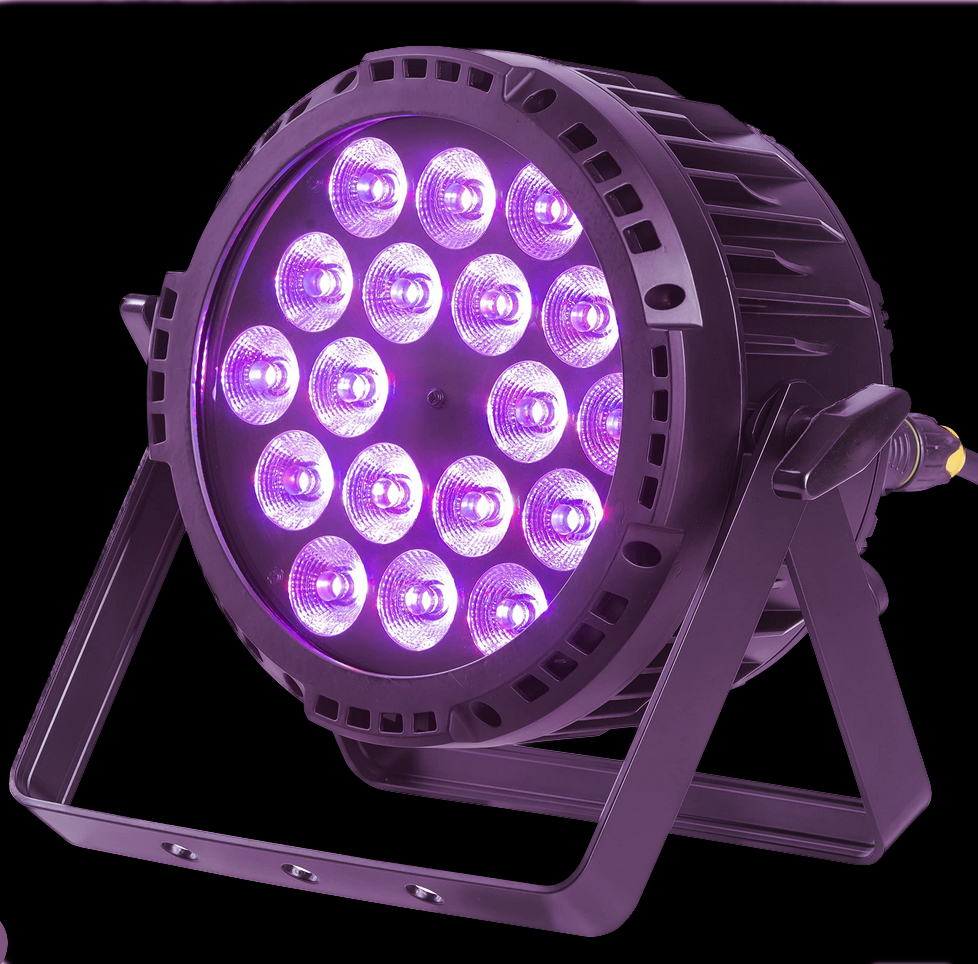
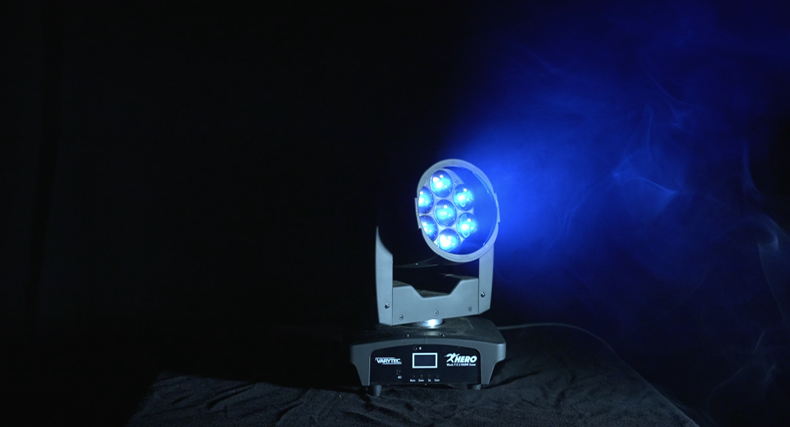

# SoundworX: Setup & Beispiel

## Das Setup

Das Soundworx-Setup besteht aus verschiedenen Lampentypen, die mit Blick auf hohe Mobilität, flexible Einsetzbarkeit und ein gutes Kosten-Nutzen-Verhältnis ausgewählt wurden. Der Anwendungsbereich soll von den ersten Schritten bis zur kleinen professionellen Umgebung reichen. Wichtig: Nicht alle Lampen sind wasserfest (IP65), das Setup ist also nur für drinnen geeignet. In den folgenden Absätzen wollen wir euch die Lampen vorstellen und erläutern, warum wir genau diese ausgewählt haben. Wir hoffen, die Informationen helfen euch auch dabei, euer eigenes Setup zusammenzustellen. Hier die Shortlist zu den Lampen:

## Die Lampen 

### Varytec 6in1 IP65 PAR

Die 4 PAR-Scheinwerfer von Varytec sind in ihrer Preisklasse die ungeschlagenen All-Rounder. Der Akku hält 20 Stunden (wenn die Lampe leuchtet, wir haben sämtliche Proben und die Aufführung unseres Abschlusses mit ihnen gemacht und sie hatten noch 80 Prozent Akku). Das [W-DMX](/primer/wdmx) funktioniert zuverlässig (gerade auch im Vergleich zu direkten Konkurrenzprodukten mit anderer WLAN-Technik). Und ansonsten leuchten sie einfach im Kegel. Es sind keine Spots, sondern eher flächige Lampen, aber mit angenehmer Helligkeit und auch in niedrigen Helligkeitsstufen sichtbar und detailiert. Empfohlen sei der Schwarzlicht-Kanal, der sehr leistungsstark ist.

> **Spezifikationen im Soundworx-Setup:** 
  DMX-Adresse: Im Menü unter „Addr“ einzustellen 
  Channel: Im Menü unter „Ch“ einzustellen; wir empfehlen 11-CH-Mode. 
  W-LAN-Einstellung: siehe W-DMX

Wir haben diese Lampen ausgewählt, da sie perfekt zum „Hinschmeißen“ sind. Das heißt, sie sind stoß- und wasserfest, werden einmal eingerichtet und funktionieren danach ohne wenn und aber. Im Soundworx-Setup funktionieren sie außerdem als Verteiler für die DMX-Strecken.

### Sunbars

Die ABL Sunbars von Eurolite verbinden zwei Funktionen. Einmal sind es LED-Blinder, also sehr helle Spotkegel, die man von Konzertbühnen kennt und die zwischendurch mal oder am Ende eines Songs zum Finale das Publikum blenden. Aber unter diesen 10 hellen LED-Spots in Warmweiß liegen noch 10 LED-Panels, die in allen Farben angesteuert werden können (genaugenommen 40, siehe Bild). Dadurch kann die Lampe als Effeklt- und Atmosphären-Lampe eingesetzt werden. Es ist dabei wichtig darauf zu achten, dass die Lampe viele Kanäle benötigt und so das größte Nadelöhr in unserem DMX-Universum ist.

> **Spezifikationen im Soundworx-Setup:** 
  DMX-Adresse: Im Menü unter „Address“ einzustellen 
  Channel: Im Menü unter „Channel Mode“ einzustellen; wir nutzen den 47 Ch-Mode (ohne 40 kleine LED-Felder)

Diese Lampen sind im Setup, weil sie zwei so unterschiedliche Funktionen vereinen. Sie können als Rampen eingesetzt werden, einen Raum in einen sanften Lichtschein werfen und die Blinder-Funktion kann nahezu grenzenlos mit den farbigen LEDs kombiniert werden. Für ihren Preisbereich machen sie ordentlich was her.

### Fluter

Seien wir ehrlich, unsere **EUROLITE LED IP PAR 12x8W QCL Spots** sind eigentlich keine Fluter. Aber hier mussten wir eine Budget-Entscheidung treffen, die wir aber auch inhaltlich verteidigen können. Denn die Eurolite Spots haben einen sehr weiten Abstrahlwinkel und hellen Räume total flächig auf. Sie lassen sich also wunderbar als Fluter einsetzen. Dazu sind sie wasserfest und hell, können also auch draußen dunkle Bereiche ausleuchten.

> **Spezifikationen im Soundworx-Setup:** 
  DMX-Adresse: Im Menü unter „Address“ einzustellen** 
  Channel: Im Menü unter „Channel Mode“ einzustellen; wir nutzen den 6Ch-Mode.

Fluter sollen möglichst gleichmäßig einen großen Bereich ausfüllen und Schatten reduzieren. Wir nutzen sie, um frontal auf die Bühne zu strahlen. Vorsicht beim Farbmischen: Da sie soweit strahlen, färben sie alles mit ein.
 

### Q-Spot

Die vier 40 W Q-Spots des Setups ermöglichen es, Akzente zu setzen, gezielt Menschen/Objekte anzuleuchten oder sichtbare Lichtstrahlen durch den Raum zu schicken. Sie sind relativ leicht, schnell aufzuhängen und machen das Lichtdesign vielseitiger und interessanter. Erwähnenswert sind auch ihre Strobe- und Flickerfunktionen, die nicht so aggressiv für die Augen aber gleichzeitig gut sichtbar und für eine schnelle Veränderung nutzbar sind.

> **Spezifikationen im Soundworx-Setup:** 
  DMX-Adresse: Im Menü unter „Address“ einzustellen 
  Channel: Im Menü unter „Channel Mode“ einzustellen; wir nutzen den 9Ch-Mode
 
Spots lassen sich gut an dunklen Stellen des Stücks/ der Show verwenden, da sie den Rest des Raums recht dunkel lassen. Häufig macht auch ein Chaser mit mehreren Spots visuell etwas her.
 

### Moving Wash

Die Soundworx-Moving Washs sind unser kleinstmöglicher Ausflug in die weite Weld der bewegten Lichter. Wir haben uns für diese Lampen entschieden, da sie maximal mobil, leicht und einfach einzusetzen sind.
